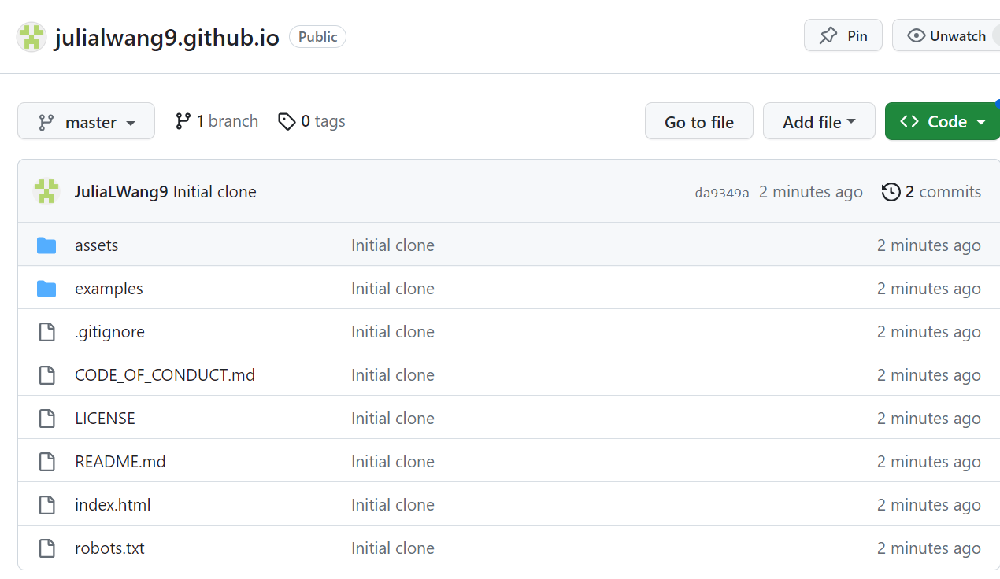
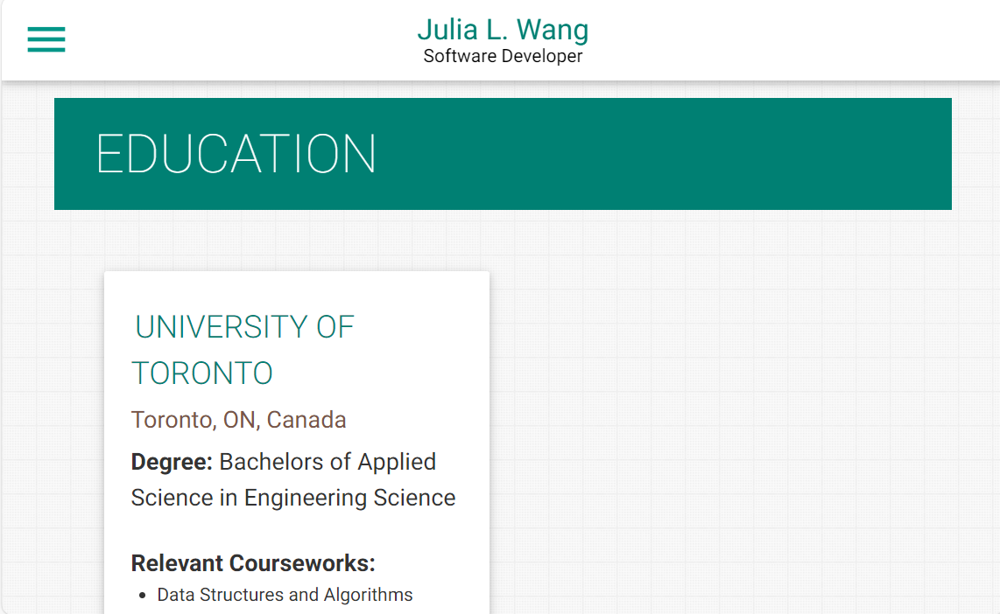
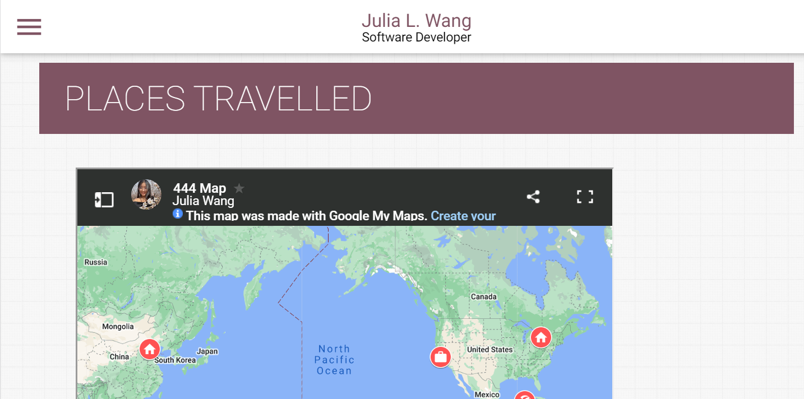
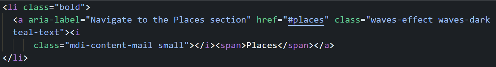
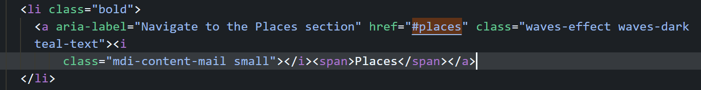

# Personal Site

Julia L. Wang | ECE344 | My actual site [here](https://www.julia-wang.dev/)

This repo is a clone of
https://github.com/varadbhogayata/varadbhogayata.github.io. 

## Activity 1

## Activity 2: adding my information
Some example screenshots:

## Activity 3: changed colors

## Activity 4: added map with places

